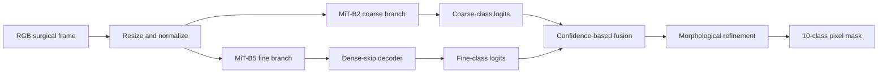

# Surg-SegFormer on SAR-RARP50

## Purpose

This implementation performs **semantic segmentation** of robotic-surgery frames.
For every input pixel, it predicts one of ten labels: background or one of nine
surgical instrument classes. It does not distinguish separate instances of the
same instrument and does not use information from earlier or later video frames.

The implementation adapts Surg-SegFormer's dual-branch idea to the local
SAR-RARP50 split. A smaller SegFormer branch handles the more common foreground
classes, while a larger branch focuses on rarer classes. Their predictions are
combined only during inference.



## Model architecture

### Coarse branch

The coarse branch uses `nvidia/mit-b2` through
`SegformerForSemanticSegmentation`. Its pretrained encoder supplies general
visual features, while a new ten-class SegFormer decode head is initialized for
SAR-RARP50.

This branch is trained on:

- `0`: background
- `1`: bipolar forceps
- `2`: prograsp forceps
- `3`: large needle driver

Pixels belonging to classes 4-9 are mapped to background for the coarse branch's
loss. The branch therefore learns to separate the three more common instrument
classes from everything else.

### Fine branch

The fine branch uses the larger pretrained `nvidia/mit-b5` encoder. Its four
encoder stages have different spatial resolutions and channel widths. The custom
dense-skip decoder:

1. Projects every encoder stage to 256 channels with a `1x1` convolution.
2. Upsamples all four projected stages to the highest encoder resolution.
3. Decodes from the deepest stage toward the shallowest stage.
4. Concatenates every earlier decoded feature into the next decoder layer.
5. Fuses the four decoded outputs and produces ten-class logits.

This branch is trained on background plus classes 4-9. Pixels belonging to
classes 1-3 are mapped to background for its loss.

### Why pretrained-model warnings appear

The NVIDIA MiT checkpoints were not trained with this repository's ten-class
segmentation heads. Consequently, Transformers reports the old ImageNet
classifier weights as `UNEXPECTED` and the new segmentation decoder weights as
`MISSING`. This is intentional:

- The B2 and B5 encoder weights are reused.
- The original classification heads are discarded.
- The B2 segmentation head and custom B5 decoder start from new weights.
- Training adapts those weights to the ten SAR-RARP50 labels.

## SAR-RARP50 adaptation

### Deterministic split

The prepared subset contains 539 annotated frames:

| Split | Frames | Source |
| --- | ---: | --- |
| Train | 326 | Training videos, seeded split |
| Validation | 81 | Training videos, seeded split |
| Test | 132 | Held-out `video_12` |

Holding out all of `video_12` avoids placing frames from the same surgical video
in both training and testing.

### Image and mask pairing

Images are stored under:

```text
notebooks/datasets/sar_rarp50/images/{train,val,test}/
```

An image name such as `video_04_000000120.jpg` is split into `video_04` and
`000000120`. The loader then reads its dense mask from:

```text
videos/video_04/segmentation/000000120.png
```

The loader uses these original dense class-ID PNG masks. The YOLO polygon label
files elsewhere in the generated dataset are not used by Surg-SegFormer.

The current label map is an identity map: source mask value `N` remains class
`N`. Unknown mask values cause an error instead of being silently converted.
Mask value `255` is reserved as the ignored label.

### Class grouping

The branch split was derived from the training set. Classes 1-3 each exceed 1%
of training pixels and are assigned to the coarse branch; classes 4-9 are
assigned to the fine branch.

| ID | Class | Branch | Training status |
| ---: | --- | --- | --- |
| 0 | background | both | learnable |
| 1 | bipolar forceps | coarse | learnable |
| 2 | prograsp forceps | coarse | learnable |
| 3 | large needle driver | coarse | learnable |
| 4 | vessel sealer | fine | learnable |
| 5 | grasping retractor | fine | learnable |
| 6 | monopolar curved scissors | fine | learnable |
| 7 | ultrasound probe | fine | learnable |
| 8 | suction instrument | fine | learnable |
| 9 | suture needle | fine | **not present in train/validation** |

Class 9 cannot be learned from this split because it has no training or
validation examples. It remains in the ten-class output so test masks preserve
their original label space. Evaluation marks it as `untrainable_by_split` and
also reports a nine-learnable-class mIoU.

### Preprocessing and augmentation

Every frame is converted from OpenCV's BGR order to RGB, scaled to `[0, 1]`, and
normalized with ImageNet mean and standard deviation. The final tensor size is
`3 x 512 x 896`.

Training augmentation consists of:

- horizontal flip with probability 0.5;
- random `448 x 784` crop with probability 0.5;
- rotation of up to 15 degrees with probability 0.5;
- resize to `512 x 896`.

Validation and test samples are only resized; random augmentation is disabled.
The same geometric operation is applied to each image and its mask.

## Training behavior

The branches are trained independently and sequentially: 100 coarse epochs,
followed by 100 fine epochs. Fusion is not part of the training loss.

For each branch, the objective is:

```text
loss = 0.7 * Tversky loss + 0.3 * cross-entropy loss
```

The Tversky loss weights false positives by `0.7` and false negatives by `0.3`.
Optimization uses Adam with a learning rate of `5e-6`, weight decay of `1e-4`,
and a cyclic learning-rate schedule rising to `5e-5`. Python, NumPy, PyTorch,
data-loader workers, and split shuffling are seeded from `42`.

Each epoch writes a `last` checkpoint. A `best` checkpoint is replaced whenever
validation loss improves:

```text
coarse_best.pth
coarse_last.pth
fine_best.pth
fine_last.pth
```

The checkpoints include model, optimizer, scheduler, and epoch state. The
current trainer saves these states but does not implement resume-on-restart.

## Inference fusion

At inference time, both branches return ten-class logits at the input image
resolution. Fusion works independently at every pixel:

1. Convert each branch's logits to probabilities and its most likely class.
2. Use the fine prediction whenever the coarse branch predicts background.
3. If both predict foreground, use the fine prediction only when its confidence
   is greater than the coarse confidence; otherwise retain the coarse result.
4. Apply one `3x3` morphological closing and opening pass.
5. Use the morphologically refined result only where both branches predicted
   foreground.

This gives the common-class branch priority while still allowing a confident
fine-class prediction to replace it.

## Evaluation and outputs

After training, `main.py` evaluates the in-memory final-epoch model on the 132
held-out test frames. It reports:

- IoU and Dice for every class;
- mean IoU over all classes;
- mean IoU over the nine potentially learnable classes;
- mean Dice;
- test-frame count and test-pixel share for every class;
- warnings for untrainable classes and classes appearing in fewer than ten test
  frames.

The training entry point evaluates the final in-memory weights; it does not
reload the `best` checkpoints first. `video_inference.py`, in contrast, loads
`coarse_best.pth` and `fine_best.pth` by default and renders colored masks over
the held-out video.

## What this adaptation does not claim

- It is a paper-derived reconstruction, not official author code.
- Configuration fields marked `ASSUMPTION` were not fully specified by the
  paper.
- The SAR-RARP50 split and label distribution differ from the paper's EndoVis
  evaluation, so the paper's reported scores are not reproduction targets.
- Frames are processed independently; there is no temporal model or tracking.
- The model performs semantic, not instance, segmentation.
- Class 9 performance cannot be representative until that class appears in
  training data.

## Relevant files

- [`config.yaml`](config.yaml): task, classes, model variants, and hyperparameters
- [`dataset_loader.py`](dataset_loader.py): frame-mask pairing and preprocessing
- [`model.py`](model.py): coarse/fine branches and dense decoder
- [`trainer.py`](trainer.py): branch targets, losses, optimization, and checkpoints
- [`fusion.py`](fusion.py): inference-time prediction fusion
- [`evaluation.py`](evaluation.py): per-class IoU and Dice metrics
- [`video_inference.py`](video_inference.py): full-video overlay rendering
- [`PROVENANCE.md`](PROVENANCE.md): reconstruction provenance and comparability note
